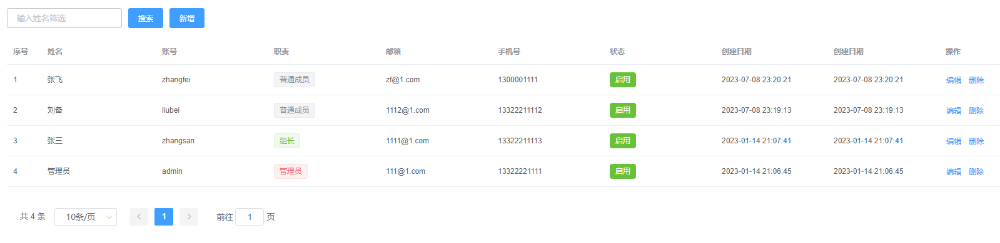
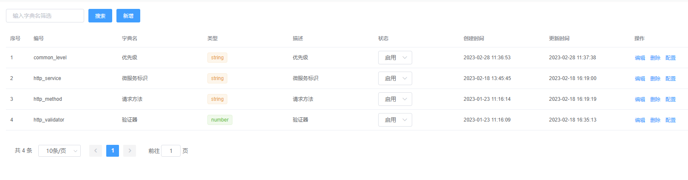
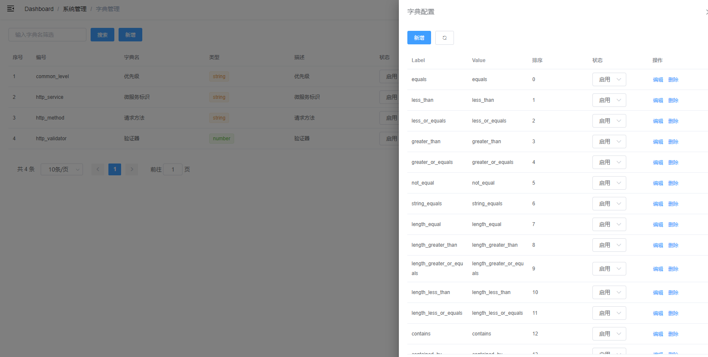
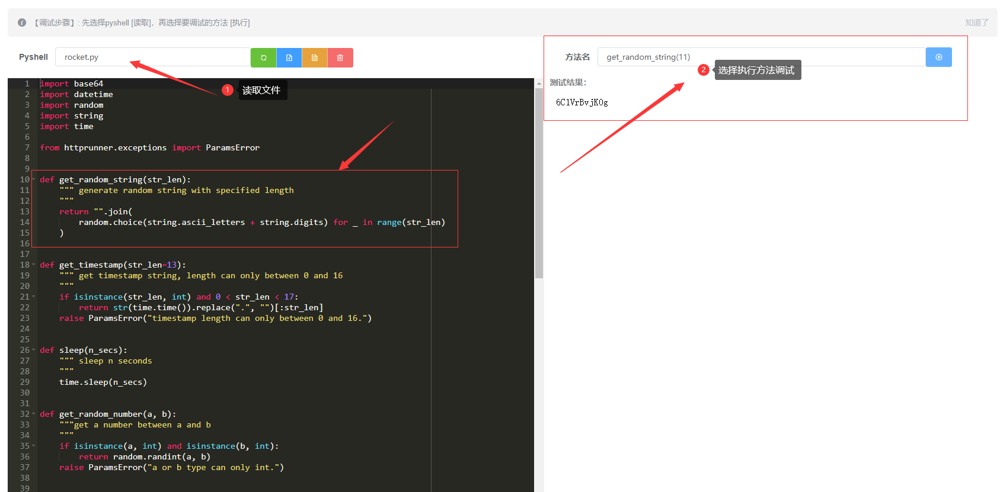
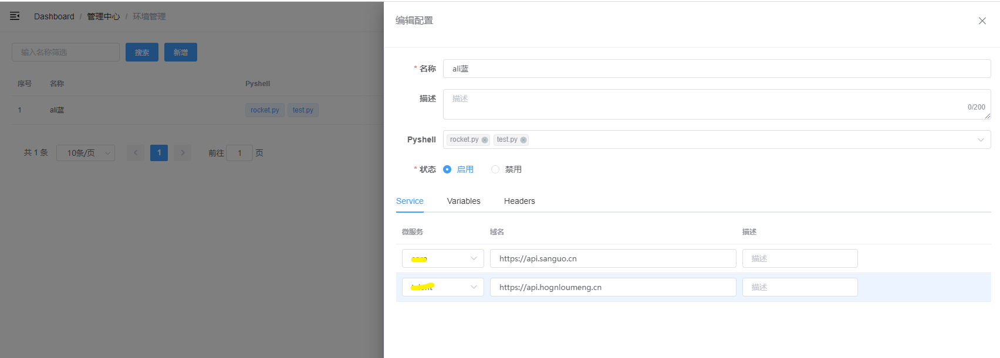
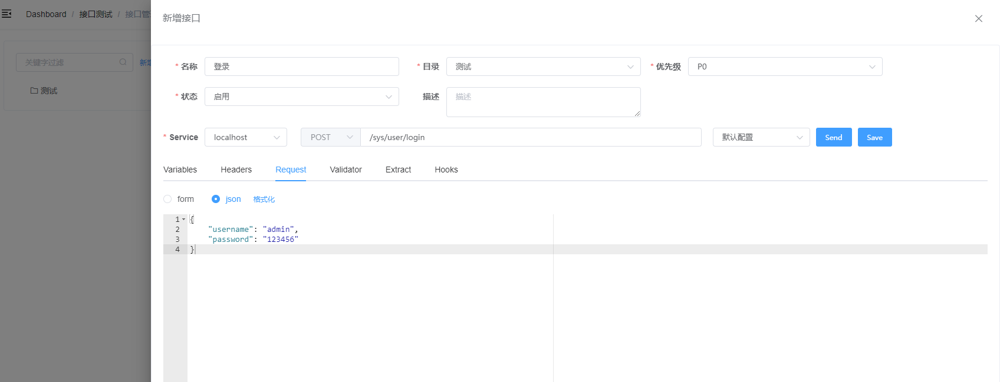
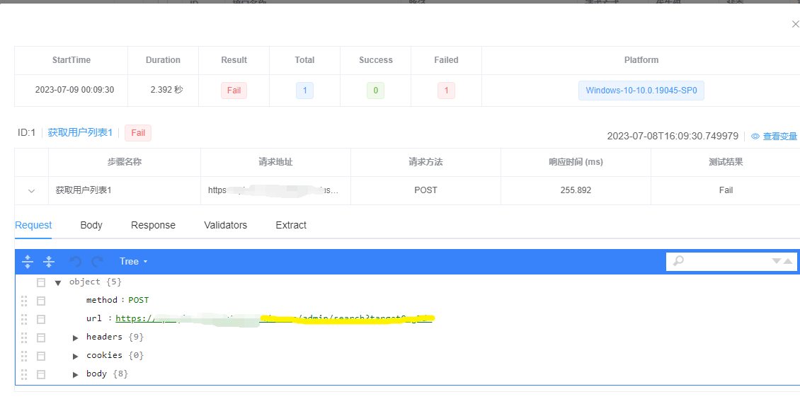
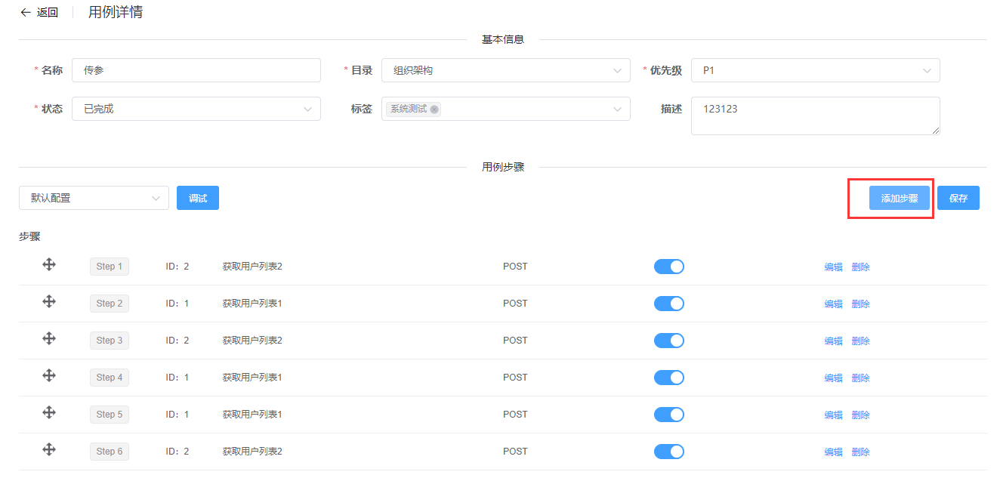
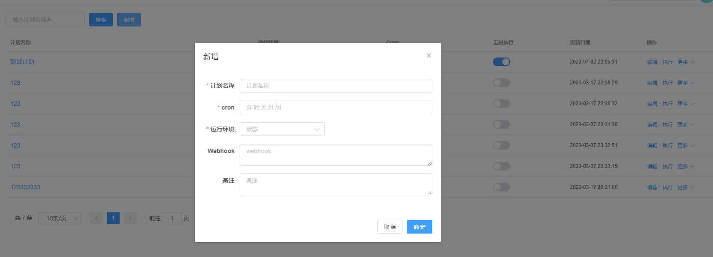
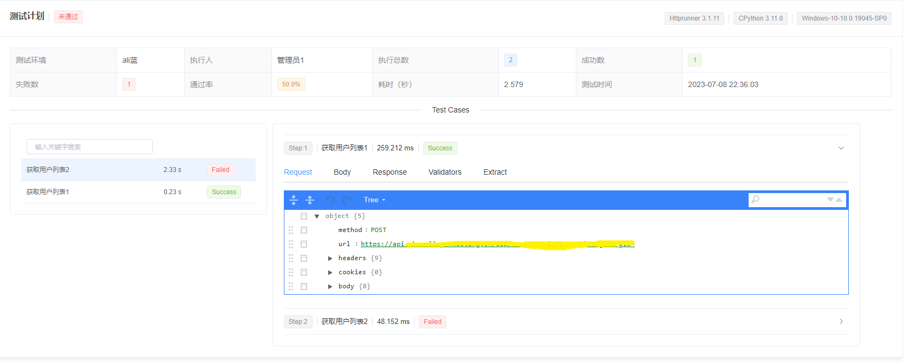

# 一、概述

Rocket是一款接口自动化测试平台，服务端是Python，前端Vue。
关键依赖：
- fastapi
- httprunner（v3.1.11版本）
- apscheduler
- element-ui

# 二、功能模块
核心功能模块基本开发完成，可以直接拿来用，一些细节功能待开发，具体如下：
- 系统管理
    - [x] 用户管理
    - [x] 字典管理
- 管理中心
    - [x] 项目管理
    - [x] 脚本管理
    - [x] 环境管理
- 接口测试
    - [x] 接口管理
    - [x] 用例管理
    - [x] 测试计划
    - [x] 报告中心
    
# 三、部分截图
### 用户管理

### 字典管理

### 项目管理

### 脚本管理

### 环境管理

### 接口编辑

### 接口执行结果

### 用例管理

### 测试计划

### 报告

